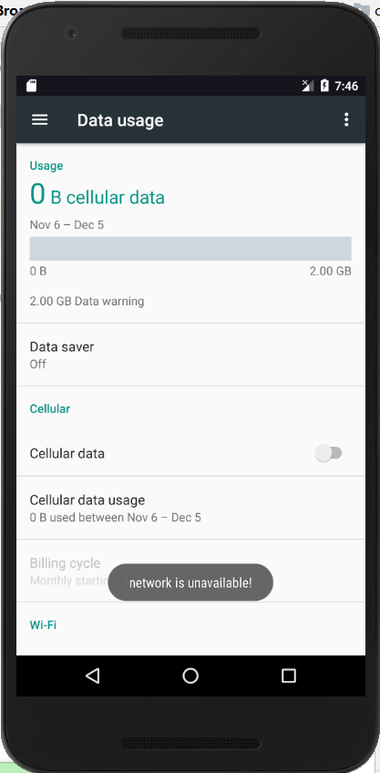
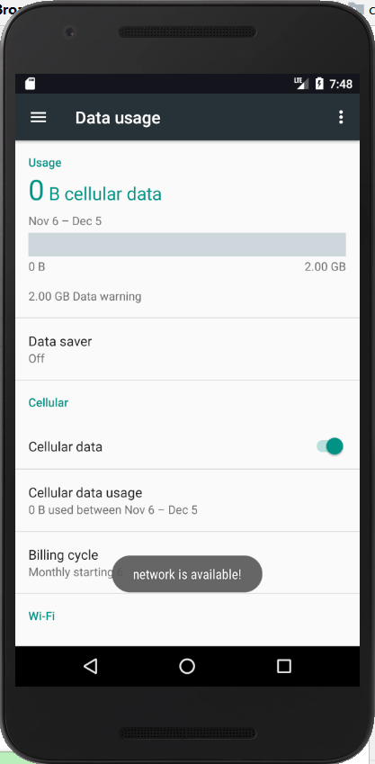
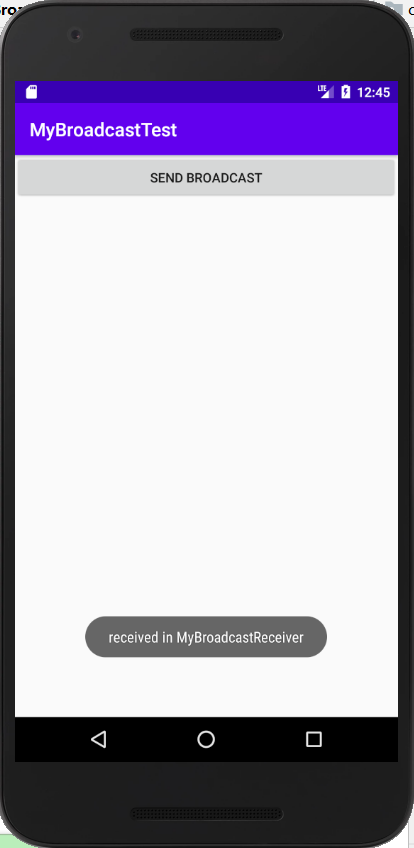

# Android广播机制  

## 广播机制简介  

### 分类  
Android中的广播主要可以分为以下两种类型：  
+ 标准广播：是一种完全异步执行的广播。广播发出后，所有的广播接收器几乎都会在同一时刻接收到这条广播信息，因此它们之间没有任何先后顺序可言。  
特点：  
	+ 广播接收器之间的执行顺序是不明确的
	+ 效率较高，无法被截断
+ 有序广播：是一种同步执行的广播。在广播发出后，同一时刻只会有一个广播接收器能够收到这条广播信息，当这个广播接收器中的逻辑执行完毕后，广播才会继续传递。  
特点：
	+ 广播接收器需要按照优先级依次执行
	+ 可截断，前面的广播接收器可以截断正在传递的广播  

### 应用场景  
+ 同一应用具有多个进程的不同组件之间的消息通信
+ 不同应用间的组件之间的消息通信
+ 与Android系统在特定情况下的通信（系统开机，网络变化等 ）

## 接收系统广播  

### System Broadcast(系统广播)
+ Android系统内置了很多系统级别的广播，只要涉及到手机的基本操作（比如手机开机、电池电量发生变化、时区或地区发生改变），基本上都会发出相应的系统广播。

+ 每个系统广播都具有特定的**intent-filter**，其中主要包括具体的**action**，系统广播发出后，将被相应的**BroadcastReceiver**接收。系统广播在系统内部当特定事件发生时，由系统自动发出。  

### 广播的两种注册方式  

#### 动态注册  
通过动态注册的方式编写一个监听网络变化的程序  

1. 在AndroidManifest.xml中添加权限：    

```
 <uses-permission android:name="android.permission.ACCESS_NETWORK_STATE" />
```

2. MainActivity中的代码如下：

```
public class MainActivity extends AppCompatActivity {

    private IntentFilter intentFilter;

    private NetworkChangeReceiver networkChangeReceiver;

    @Override
    protected void onCreate(Bundle savedInstanceState) {
        super.onCreate(savedInstanceState);
        setContentView(R.layout.activity_main);
        intentFilter = new IntentFilter();
        intentFilter.addAction("android.net.conn.CONNECTIVITY_CHANGE");
        networkChangeReceiver = new NetworkChangeReceiver();
        registerReceiver(networkChangeReceiver, intentFilter);
    }

    @Override
    protected void onDestroy() {
        super.onDestroy();
        unregisterReceiver(networkChangeReceiver);
    }

    class NetworkChangeReceiver extends BroadcastReceiver {

        @Override
        public void onReceive(Context context, Intent intent) {
            ConnectivityManager connectionManager = (ConnectivityManager) getSystemService(Context.CONNECTIVITY_SERVICE);
            NetworkInfo networkInfo = connectionManager.getActiveNetworkInfo();
            if (networkInfo != null && networkInfo.isAvailable()) {
                Toast.makeText(context, "network is available!", Toast.LENGTH_SHORT).show();
            } else {
                Toast.makeText(context, "network is unavailable!", Toast.LENGTH_SHORT).show();
            }


        }
    }
}
```
3. 运行程序，按下Home键→Settings→Data usage。关闭Cellular data会弹出无网络可用的提示，如图： 

  

重新打开Cellular data会弹出网络可用的提示，如图：  

  

#### 静态注册  
通过静态注册让程序接收一条开机广播  

1. 在com.example.broadcasttest包添加广播接收器BootCompleteReceiver  

```
public class BootCompleteReceiver extends BroadcastReceiver {

    @Override
    public void onReceive(Context context, Intent intent) {
        Toast.makeText(context, "Boot Complete", Toast.LENGTH_LONG).show();
    }
}
```  
2. 在AndroidManifest.xml中添加权限：  

```
<uses-permission android:name="android.permission.RECEIVE_BOOT_COMPLETED"/>
```  
3. 在`receiver`闭包里添加`<intent-filter>`便签  

```
<receiver
    android:name=".BootCompleteReceiver"
    android:enabled="true"
    android:exported="true">
    <intent-filter>
        <action android:name="android.intent.action.BOOT_COMPLETED" />
    </intent-filter>
</receiver>
```  

4. 将模拟器关闭后重新启动，在启动完成之后就会收到开机广播。

#### 总结  
动态注册和静态注册的区别：

+ 动态注册的广播接收器可以自由的控制注册和取消，有很大的灵活性。但是只能在程序启动之后才能收到广播。注册的逻辑是在onDestroy()方法中的，所以广播接收器的生命周期是和当前活动的生命周期一样。

+ 静态注册的广播不受程序是否启动的约束，当应用程序关闭之后，还是可以接收到广播。  

## 发送自定义广播  

### 标准广播  
1. 定义一个广播接收器接收你将要发送的广播，新建MyBroadcastReceiver类，代码如下：  

```
public class MyBroadcastReceiver extends BroadcastReceiver {
    @Override
    public void onReceive(Context context, Intent intent) {
        //MyBroadcastReceiver收到自定义广播时，弹出"received in MyBroadcastReceiver"提示
        Toast.makeText(context, "received in MyBroadcastReceiver", Toast.LENGTH_SHORT).show();
    }
}
```  
2. 在AndroidManifest中对广播接收器进行修改  

```
<receiver
            android:name=".MyBroadcastReceiver"
            android:enabled="true"
            android:exported="true">
            <intent-filter>
                <action android:name="com.example.broadcasttest.MY_BROADCAST" />
            </intent-filter>
        </receiver>
```  

3. 定义一个按钮，作为发送广播的触发点，activity_main.xml中添加如下代码：  

```
<Button
    android:id="@+id/button"
    android:layout_width="match_parent"
    android:layout_height="wrap_content"
    android:text="Send Broadcast"></Button>
```  

4. 在按钮的点击事件里面加入发送自定义广播的逻辑，修改MainActivity中的代码：  

```
Button button = (Button) findViewById(R.id.button);
        button.setOnClickListener(new View.OnClickListener() {
            @Override
            public void onClick(View view) {
                Intent intent = new Intent("com.example.broadcasttest.MY_BROADCAST");
                sendBroadcast(intent);
            }
        });
```  
5. 运行程序，点击Send Broadcast按钮，效果如下：

  

### 有序广播  


