# 期末大作业——友人帐APP  

## 开发背景  
人们常说“好记性不如烂笔头”，不同于以往的纸质账单，现代社会我们更需要一个简单易用的记账类APP作为个人的电子账本，记录我们生活的每一笔支出，有效管理个人收支。同时，各类小型企业也需要一个安全易用的记账类APP记录公司日常财政运营情况。  

## 主要功能  
+ 开启软件后界面如下，可选择登录或注册功能     
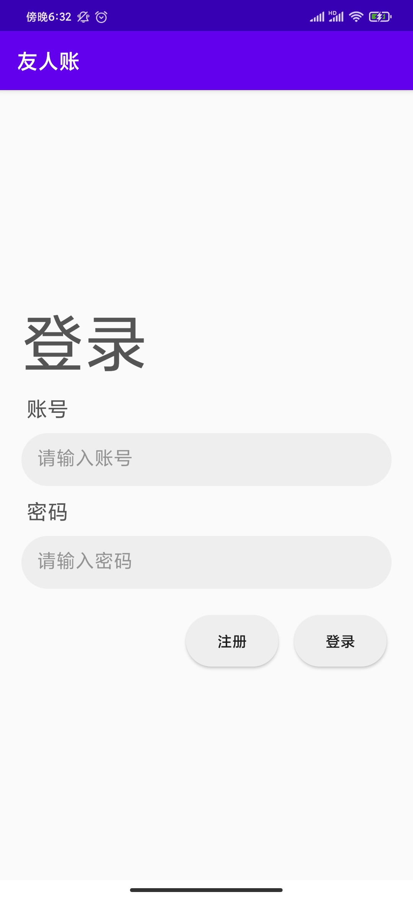  

+ 注册  

+ 登录  
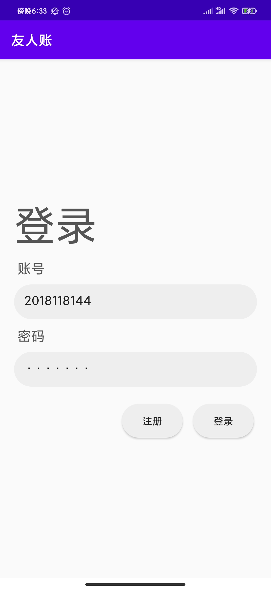  

+ 登录成功后主界面  
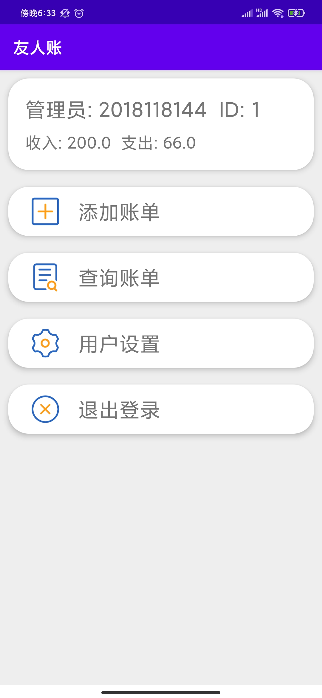  

+ 添加账单功能  
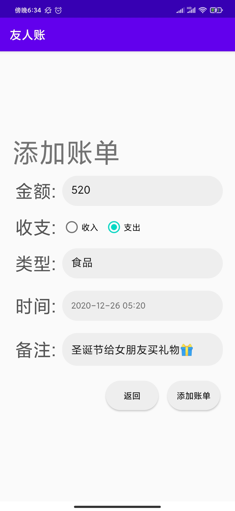  

+ 添加账单时点击类型输入框可弹出复选框  
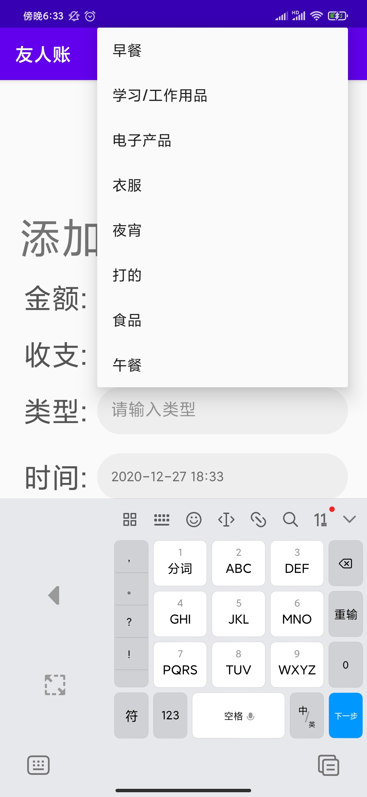  

+ 查看全部账单，长按可删除账单    
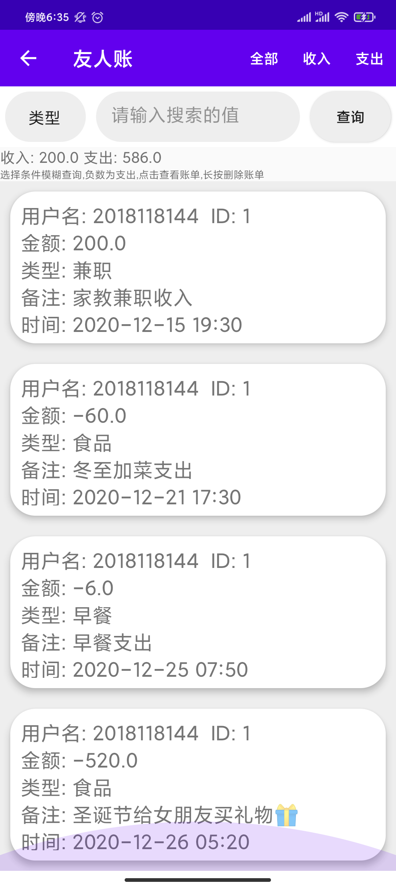  
  
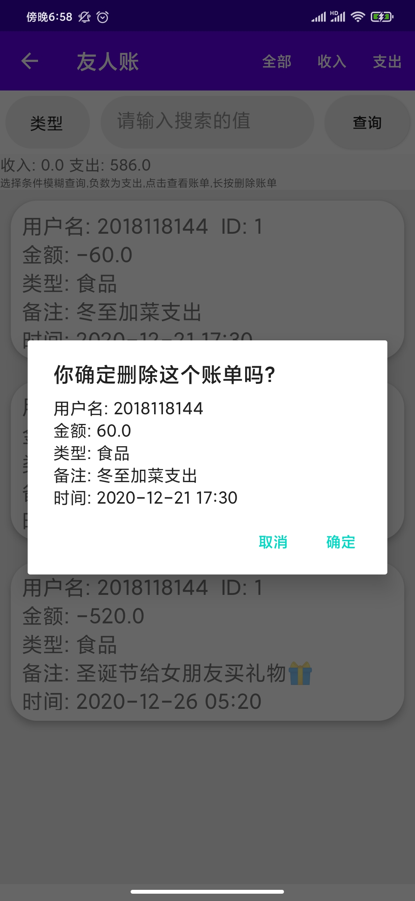

+ 根据账单类型查询账单  
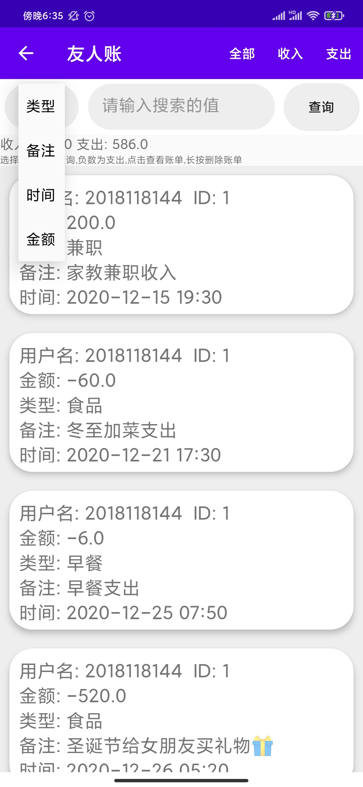  

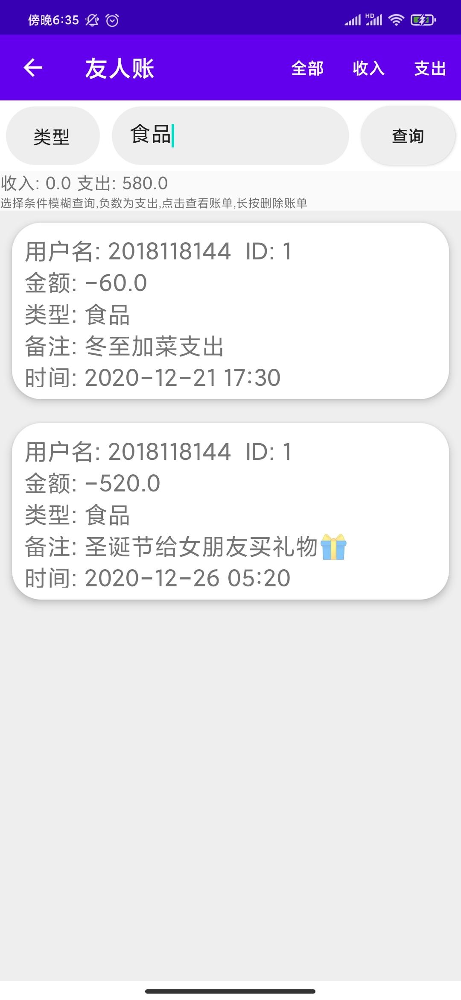  

+ 用户设置界面  
  

+ 自由编辑收支类型  
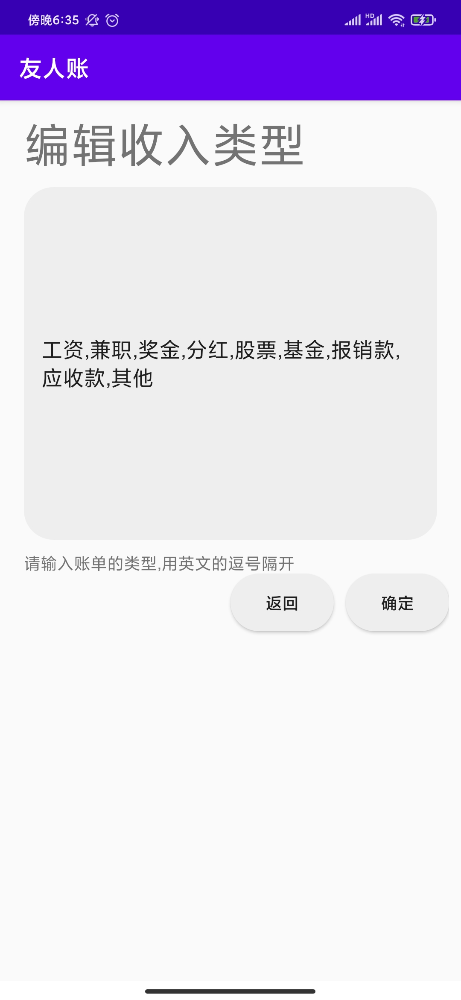  
 
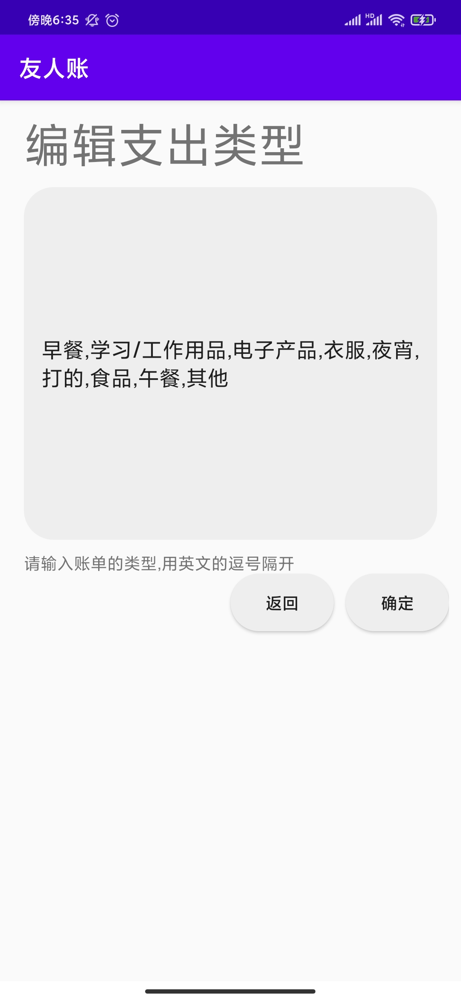  

+ 清空收支账单  
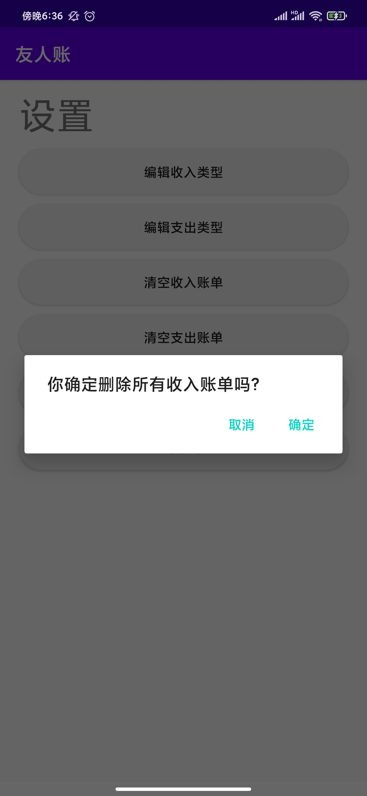  
 
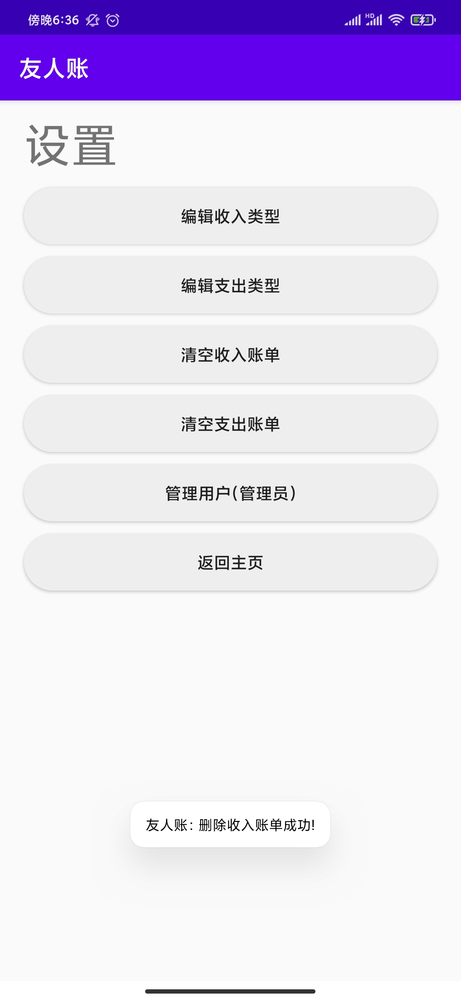  

+ 退出  
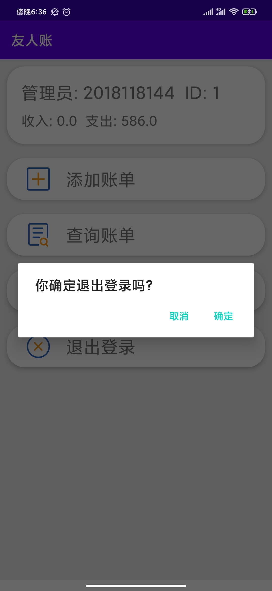  

  

