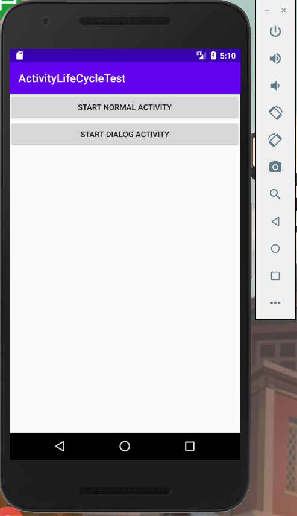

#活动的生命周期  
##活动状态
每个活动在其生命周期中最多可能会有四种状态  

运行状态  
当一个活动位于返回栈的栈顶时，这时活动就处于运行状态。 

暂停状态  
当一个活动不再处于栈顶位置，但仍然可见时，这时活动就进入了暂停状态。

停止状态  
当一个活动不再处于栈顶位置，并且完全不可见的时候，就进入了停止状态。系统仍然会为这种活动保存相应的状态和成员变量，但是这并不是完全可靠的，当其他地方需要内存时，处于停止状态的活动有可能会被系统回收。  

销毁状态  
当一个活动从返回栈中移除后就变成了销毁状态。

##活动的生存期
Activity 类中定义了七个回调方法，覆盖了活动生命周期的每一个环节。

1.onCreate()  

这个方法会在活动第一次被创建的时候调用。应在这个方法中完成活动的初始化操作，比如说加载布局、绑定事件等。

2.onStart()

这个方法在活动由不可见变为可见的时候调用。

3.onResume()

这个方法在活动准备好和用户进行交互的时候调用。此时的活动一定位于返回栈的栈顶，并且处于运行状态。

4.onPause()

这个方法在系统准备去启动或者恢复另一个活动的时候调用。

5.onStop()

这个方法在活动完全不可见的时候调用。它和onPause()方法的主要区别在于，如果启动的新活动是一个对话框式的活动，那么onPause()方法会得到执行，而onStop()方法并不会执行。

6.onDestroy()

这个方法在活动被销毁之前调用，之后活动的状态将变为销毁状态。

7.onRestart()

这个方法在活动由停止状态变为运行状态之前调用，也就是活动重新启动。

##活动的生命周期实验  

在onCreate()方法中，我们分别为两个按钮注册了点击事件，点击第一个按钮会启动NormalActivity，点击第二个按钮会启动 DialogActivity。在Activity的七个回调方法中分别打印了一句话，这样就可以通过观察日志的方式来更直观地理解活动的生命周期。  

启动程序：  

  

此时logcat中打印出日志信息：  

  

  
  
MainActivity 第一次被创建时会依次执行 onCreate()、onStart()和 onResume()方法。点击START NORMAL ACTIVITY按钮，启动 NormalActivity 
 
  

此时logcat打印日志信息： 
 

按下 Back 键返回 MainActivity后，日志信息：
 
  

点击START DIALOG ACTIVITY按钮，启动 DialogActivity

 

打印日志信息：

DialogActivity 并没有完全遮挡住 MainActivity，此时 MainActivity 只是进入了暂停状态，并没有进入停止状态。相应地，按下Back 键返回 MainActivity 也应该只有onResume()方法会得到执行。返回 MainActivity打印日志：  

  、

按下back退出程序，打印信息：  

