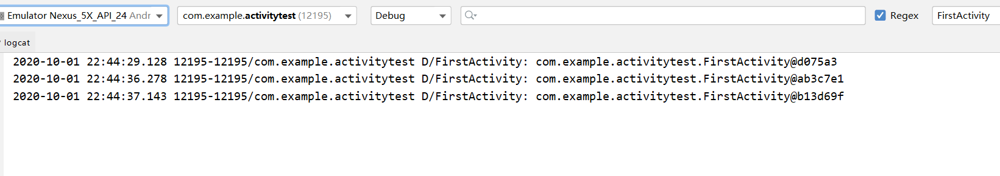
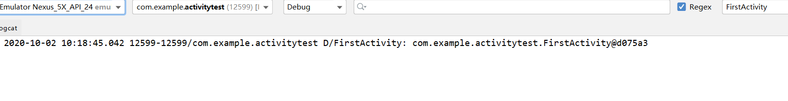
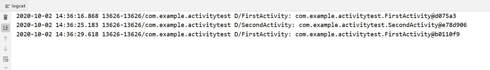
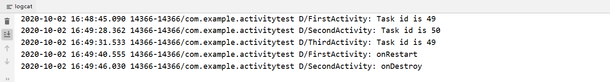

# 活动的启动模式
活动的启动模式一共有四种，分别是**standard、singleTop、singleTask**和**singleInstance**  

如何选择活动的启动模式？  
在AndroidManifest.xml中通过给`<activity>`标签制定`android:launchMode`属性选择启动模式  

## standard模式  
standard模式：在不进行显式指定的情况下，所有活动默认都会自动使用这种启动模式  

在standard模式下，每当启动一个新的活动，它就会在返回栈中入栈，并处于栈顶的位置。对于使用该模式的活动，系统不会在乎这个活动是否已经在返回栈中存在，每次启动都会创建该活动的一个新的实例 

### standard模式测试    
修改FirstActivity中onCreate()方法的代码  

` Log.d("FirstActivity",this.toString());//调用toString()方法打印FirstActivity的哈希值，通过观察logcat中打印的哈希值验证是否创建出新的FirstActivity实例` 

`Intent intent=new Intent(FirstActivity.this,FirstActivity.class);//在FirstActivity的基础上启动FirstActivity`  
`startActivity(intent);`  

### 测试结果  
  
  

从logcat打印信息可以看出，每点击一次按钮就会创建一个新的FirstActivity实例，也就是说，每点击一次按钮，就会往返回栈中添加一个新的实例。退出程序时，添加了几个实例就要点击几次back键  

## singleTop模式  
两种启动模式的对比  

| 启动模式| 返回栈 | 是否创建新实例 |  
| -- | :--:| :--: |
| standard | 系统不会在乎活动是否在返回栈中存在，直接创建新活动 | 是 |  
| singleTop | 系统检查返回栈顶是否存在该活动，若存在，直接调用 | 不一定 |  

### singleTop模式测试    
只需在AndroidManifest.xml`<activity>`标签下添加`android:launchMode`属性即可  

`android:launchMode="singleTop"`  

### 测试结果  
运行程序，从logcat打印信息可以看到已经创建了一个FirstActivity实例  



点击按钮，发现无论点击多少次按钮都不会再出现新的打印信息，这是因为启动活动时FirstActivity已经处于返回栈栈顶，每当想要启动一个FirstActivity时都会直接使用栈顶的活动。因此FirstActivity只有一个实例，仅按一次back键即可退出程序  

那么，FirstActivity并未处于栈顶位置时，再启动FirstActivity，是否会创建新实例？  
测试  
首先修改FirstActivity中onCreate()方法代码  

`Intent intent = new Intent(FirstActivity.this, SecondActivity.class);//在FirstActivity的基础上启动SecondActivity`  

点击按钮启动后启动SecondActivity，相应地，修改修改SecondActivity中onCreate()方法代码  

`Intent intent = new Intent(SecondActivity.this, FirstActivity.class);//在SecondActivity基础上启动FirstActivity`  
`startActivity(intent);`  

运行程序，查看logcat信息：  

  

可见系统创建了两个不同的FirstActivity实例。当SecondActivity中再次启动FirstActivity时，此时返回栈顶是SecondActivity，系统检查到返回栈顶并非将要被创建的活动，因此会创建新的FirstActivity实例。此时按下back键会返回到SecondActivity，再按下back键回到FirstActivity，又按一次back键才会退出程序  

## singleTask模式  
当活动的启动模式指定为singleTask，每次启动该活动时系统首先会在返回栈中检查是否存在该活动的实例，如果发现已经存在则直接使用该实例，并把在这个活动之上的所有活动统统出栈，发现不存在则直接创建一个新的实例。**（注：singleTask模式并非检查活动是否在栈顶，只要活动在返回栈中存在，则直接使用该实例，并把该活动之上的活动统统出栈，出栈后栈顶即为该活动）**  

### singleTask模式测试  
首先在AndroidManifest.xml修改启动模式为singleTask  

`android:launchMode="singleTask"`  

在FirstActivity中添加onRestart()方法  

```
    @Override
    protected void onRestart() {
        super.onRestart();
        Log.d("FirstActivity", "onRestart");
    }
```  

最后在SecondActivity中添加onDestroy()方法  
```
    @Override
    protected void onDestroy() {
        super.onDestroy();
        Log.d("SecondActivity", "onDestroy");
    }
```  

运行程序，在FirstActivity界面点击按钮进入SecondActivity后，在SecondActivity界面点击按钮进入FirstActivity，观察logcat打印信息： 


onRestart()、onDestroy()方法均被调用，同时我们惊喜地发现，只需要按一次back键即可退出程序，这是为什么？  
这是因为在singleTask模式下，当通过SecondActivity启动FirstActivity时，FirstActivity已经存在返回栈中，且在栈底，而SecondActivity在返回栈栈顶。那么SecondActivity会从返回栈中出栈，onDestroy()方法被调用，之后FirstActivity重新成为栈顶活动，onRestart()方法得到执行。现在返回栈中只剩下FirstActivity一个活动，自然按一下back键就能退出程序。  

## singleInstance模式  
场景：假设程序中有一个活动是允许其他程序调用的，如果我们想要实现其他程序和我们的程序可以共享该活动的实例，应该如何实现？  

显然用前三个模式无法实现，因为同一个活动在不同的返回栈中入栈时必然是创建了新的实例。使用singleInstance模式就可以解决共享活动实例的问题，在这种模式下会启用一个新的单独的返回栈来管理这个活动，不管是哪个程序访问该活动，都共用同一个返回栈。  

### singleInstance模式测试  
首先在AndroidManifest.xml将SecondActivity的启动模式改为singleInstance  

```
<activity
            android:name=".SecondActivity"
            android:launchMode="singleInstance">
 </activity>
```  

修改FirstActivity中onCreate()方法代码  

`Log.d("FirstActivity", "Task id is " + getTaskId());//该方法用于打印出返回栈的id`  

修改SecondActivity中onCreate()方法代码  

`Log.d("SecondActivity", "Task id is " + getTaskId());//该方法用于打印出返回栈的id`  

`Intent intent = new Intent(SecondActivity.this, ThirdActivity.class);//在SecondActivity基础上启动ThirdActivity`  

最后修改ThirdActivity中onCreate()方法代码  

`Log.d("ThirdActivity", "Task id is " + getTaskId());`  

运行程序，在FirstActivity界面点击按钮进入SecondActivity后，在SecondActivity界面点击按钮进入到ThirdActivity，观察打印日志：  

  

显而易见，SecondActivity的返回栈id与另外两个活动不同，这说明SecondActivity确实存在一个单独的返回栈中，而且这个栈中只有SecondActivity一个活动  

按下back键进行返回，我们发现ThirdActivity直接返回到了FirstActivity，再按下back键，又返回到SecondActivity，再按下back键才退出程序，这是为什么？  
这是因为FirstActivity和ThirdActivity是存放在同一个返回栈内，那么当按下back键后，ThirdActivity出栈，此时FirstActivity成为栈顶活动。然后在FirstActivity界面再次按下back键，随着FirstActivity出栈，当前的返回栈已空，于是就显示了另一个返回栈的栈顶活动，即SecondActivity。再次按下back键，所有返回栈空，退出程序。


    
    


