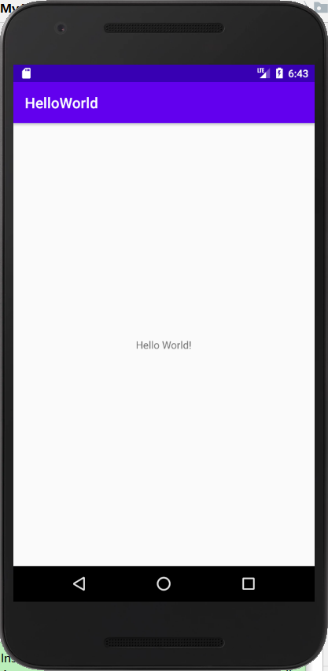

# 第一个Android项目——HelloWorld  

## 创建HelloWorld项目  

1. 在AndroidStudio的欢迎界面点击Start a new Android Studio project。    

2. 选择EmptyActivity创建一个空活动，点击Next按钮。

3. 填写项目名、包名、项目存储路径，选择编程语言以及SDK的版本，点击Finish按钮，稍等片刻。  

4. AndroidStudio自动为我们生成了很多东西，因此不需要编写任何代码，HelloWorld项目创建成功。

5. 设置模拟器，点击Android Studio顶部工具栏中的图标（如下图标红下划线）：  

6. 选择自己喜欢的模拟器，可以是手机、平板、穿戴设备等，选择设备的Android系统版本为7.0，指定模拟器的名字、分辨率、横竖屏等信息，全部设置好后点击Finish。  

7. 运行HelloWorld项目到模拟器上，点击顶部工具栏中的三角形按钮或使用快捷键CTRL+SHIFT+F10，稍等片刻，HelloWorld成功运行到模拟器上，如图：  

  

