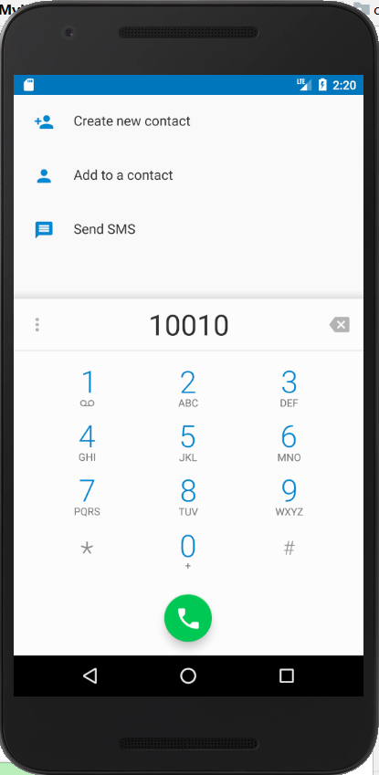
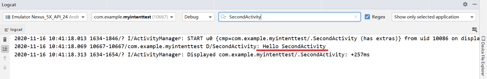
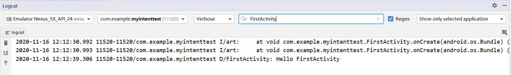

# Intent应用  

Intent是Android程序中各组件之间进行交互的一种重要方式，不仅可以指明当前组件想要执行的动作，还可以在不同组件之间传递数据。  
Intent使用场景：  
+ 启动活动  
+ 启动服务  
+ 发送广播 

## 显式Intent  
显式意图明确指明了启动活动的上下文和想要启动的目标活动和Intent应该传递给哪个组件。  

### 使用显式Intent  

1. 创建活动FirstActivity，并设置为主活动，代码如下：  

```
<intent-filter>
    <action android:name="android.intent.action.MAIN" />
    <category android:name="android.intent.category.LAUNCHER" />
</intent-filter>
```

2. 创建活动SecondActivity，修改second_layout.xml中的代码如下：  

```
<LinearLayout xmlns:android="http://schemas.android.com/apk/res/android"
    android:layout_width="match_parent"
    android:layout_height="match_parent"
    android:orientation="vertical">

    <Button
        android:id="@+id/button_2"
        android:layout_width="match_parent"
        android:layout_height="wrap_content"
        android:text="It's button 2" />
</LinearLayout>
```  

3. 修改FirstActivity中的按钮点击事件：  
          

```
                Intent intent = new Intent(FirstActivity.this, SecondActivity.class);
                startActivity(intent);
```  
4. 运行程序，点击FirstActivity界面的按钮，成功启动SecondActivity这个活动，如图：  

  

## 隐式Intent    
隐式意图：没有明确指定组件名的Intent为隐式意图。 Android系统会根据隐式意图中设置的动作(action)、类别(category)、数据（URI和数据类型）找到最合适的组件来处理这个意图。  

### 使用隐式Intent  
1. 配置`<intent-filter>`标签的内容，指定SecondActivity活动能够响应的action和category，代码如下：

```
<activity android:name=".SecondActivity">
            <intent-filter>
                <action android:name="com.example.myintenttest.ACTION_START" />
                <category android:name="android.intent.category.DEFAULT" />
            </intent-filter>
        </activity>
```  
2. 修改FirstActivity中的按钮点击事件，代码如下：  
            


```
public void onClick(View view) {
    Intent intent = new Intent("com.example.myintenttest.ACTION_START");//与intent-filter中的action标签相匹配
    startActivity(intent);
}
```  
3. 重新运行程序，点击FirstActivity界面的按钮，成功启动SecondActivity，只不过这次使用隐式方式启动，说明<activity>标签下配置的action和category内容已生效。  

  

### 隐式Intent的其他用法  

隐式Intent不仅可以启动自己程序内的活动，还可以启动其他程序的活动，使得Android多个应用程序之间的功能共享成为可能。      

#### 使用隐式Intent调用系统浏览器  
1. 修改FirstActivity中按钮点击事件的代码：  
          
```
Intent intent = new Intent(Intent.ACTION_VIEW);
intent.setData(Uri.parse("http://www.baidu.com"));
startActivity(intent);
```  
2.  重新运行程序，点击FirstActivity界面的按钮，可以看到系统浏览器打开并成功访问百度主页，如图：  
  

#### 使用隐式Intent调用系统拨号界面  
1. 指定Intent的action为`Intent.ACTION_DIAL`，这是Android的一个内置动作：  

```
Intent intent = new Intent(Intent.ACTION_DIAL);
```

2. 改变`setData()`方法中`Uri.parse`参数中的协议如下：  
          

```
intent.setData(Uri.parse("tel:10010"));
```  
3. 重新运行程序，点击FirstActivity界面的按钮，效果如下：  
  

### 使用Intent在活动间传递数据  
Intent中提供了一系列`putExtra()`方法的重载，可以把我们想要传递的数据暂时存在Intent中，启动另一个活动后，只需要把这些数据再从Intent中取出即可。

#### 向下一个活动传递数据  
将FirstActivity中的字符串传递到SecondActivity中  
1. 重写FirstActivity中`onClick()`方法的逻辑，代码如下：  

```
String data = "Hello SecondActivity";
                Intent intent = new Intent(FirstActivity.this, SecondActivity.class);
                intent.putExtra("extra_data", data);
                startActivity(intent);
```  
2. 在SecondActivity中将传递的数据取出，代码如下：  

```
Intent intent = getIntent();
        String data = intent.getStringExtra("extra_data");
        Log.d("SecondActivity", data);
```  
3. 重新运行程序，点击FirstActivity界面的按钮，跳转到SecondActivity，查看logcat打印信息如图：  
  

#### 返回数据给上一个活动  
调用Activity中的`StartActivityForResult()`方法，该方法期望在活动销毁的时候能够返回一个结果给上一个活动。这样，我们只需在当前活动按一下back键，即可实现返回数据给上一个活动。  

1. 修改FirstActivity中按钮的点击事件，代码如下：  
         

```
   Intent intent = new Intent(FirstActivity.this,SecondActivity.class);
            startActivityForResult(intent,1);
```

2. 在SecondActivity中给按钮注册点击事件，并在点击事件中添加返回数据的逻辑，代码如下：  

```
Button button2 = (Button) findViewById(R.id.button_2);
        button2.setOnClickListener(new View.OnClickListener() {
            @Override
            public void onClick(View view) {
                Intent intent = new Intent();
                intent.putExtra("data_return","Hello FirstActivity");
                setResult(RESULT_OK,intent);
                finish();
            }
        });
    } 
```

3. 在FirstActivity中重写`onActivityResult()`方法：  

```
  @Override
    protected void onActivityResult(int requestCode, int resultCode, @Nullable Intent data) {
        super.onActivityResult(requestCode, resultCode, data);
        switch (requestCode) {
            case 1:
                if (resultCode == RESULT_OK) {
                    String returnedData = data.getStringExtra("data_return");
                    Log.d("FirstActivity", returnedData);
                }
                break;
            default:
        }
    }
```

4. 重新运行程序，点击FirstActivity界面的按钮，跳转到SecondActivity，在SecondActivity界面点击按钮回到FirstActivity，这时查看打印信息：  

  

可以看到，SecondActivity成功将数据返回给FirstActivity。


