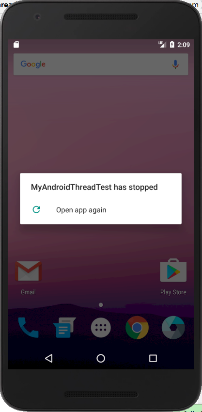
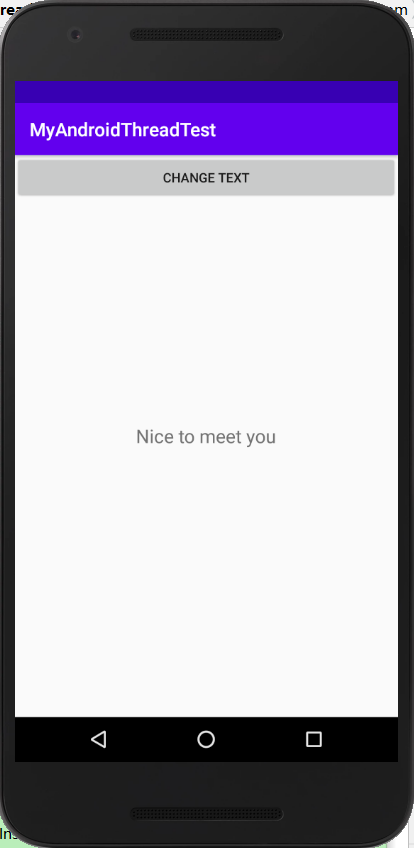

# Android多线程编程与消息处理机制

@(安卓)


## 安卓多线程编程  

### 进程与线程简介 
+ 进程是指一个内存中运行的应用程序，每个进程都有自己独立的一块内存空间，一组系统资源。  

+ 线程是指进程中的一个执行流程，一个进程中可以运行多个线程。线程与进程相似，是一段完成某个特定功能的代码，是程序中单个顺序的流控制。  

+ 二者区别  
	+ 每个进程的**内部数据和状态都是完全独立的，进程不依赖于线程而独立存在**，一个进程中可以启动多个线程。
	+ 同类的多个线程共享一块内存空间和一组系统资源，系统在各个线程之间切换时，资源占用要比进程小得多，故线程也被称为轻量级进程。**线程总是属于某个进程，线程没有自己的虚拟地址空间，与进程内的其他线程一起共享分配给该进程的所有资源。**线程是不能够独立执行的，必须依存在应用程序中，由应用程序提供多个线程执行控制。  

### 多线程的使用场景  

#### 多线程简介
多线程是指在单个程序中可以同时运行多个不同的线程，执行不同的任务。多线程意味着一个程序的多行语句可以看上去几乎在同一时间内同时运行。 “同时”执行是人的感觉，在线程之间实际上轮换执行。**即宏观上并行，微观上串行。**  

#### 使用场景  
当执行一些耗时操作，比如发送一条网络请求，由于网速等其他原因，服务器未必会立刻响应我们的请求。此时，若将这类操作放在子线程里去执行，可以防止主线程被阻塞，提高程序的执行效率。  

### 线程的两种基本用法  

#### 1、继承线程类Thread（耦合度较高）  

```
public class MyThread extends Thread {
	@Override  
    public void run() {  //处理具体的逻辑
       ...
    }

	public static void main(String[] args) {
		Thread t1 = new MyThread();
		t1.start();
	}
```

#### 2、实现Runnable接口（适合资源共享）  

```
public class MyThread implements Runnable {
	@Override  
    public void run() {  //处理具体的逻辑
       ...     
    }
}

public class TestRunnable {

	public static void main(String[] args) {
		MyThread myThread = new MyThread();
		Thread t1 = new Thread(myThread);
		t1.start();
	}
}
```  

### 在子线程中更新UI  
Android 的 UI 是线程不安全的，如果想要更新应用程序的 UI 元素，就必须在主线程中进行，否则会抛出异常（CalledFromWrongThreadException）。  

1. 新建MyAndroidThreadTest项目并修改activity_main.xml中代码如下：  

```
<RelativeLayout xmlns:android="http://schemas.android.com/apk/res/android"
    android:layout_width="match_parent"
    android:layout_height="match_parent">

    <Button
        android:id="@+id/change_text"
        android:layout_width="match_parent"
        android:layout_height="wrap_content"
        android:text="Change Text" />

    <TextView
        android:id="@+id/text"
        android:layout_width="wrap_content"
        android:layout_height="wrap_content"
        android:layout_centerInParent="true"
        android:text="Hello World!"
        android:textSize="20sp" />

</RelativeLayout>
```  
2. 我们寄希望于在Change Text 按钮的点击事件里开启一个子线程，调用TextView的setView()方法更改显示的字符串，修改MainActivity中的代码：  

```
public class MainActivity extends AppCompatActivity implements View.OnClickListener {

    private TextView textView;

    @Override
    protected void onCreate(Bundle savedInstanceState) {
        super.onCreate(savedInstanceState);
        setContentView(R.layout.activity_main);
        textView = (TextView) findViewById(R.id.text);
        Button changeText = (Button) findViewById(R.id.change_text);
        changeText.setOnClickListener(this);
    }

    @Override
    public void onClick(View view) {
        switch (view.getId()) {
            case R.id.change_text:
                new Thread(new Runnable() {
                    @Override
                    public void run() {
                        textView.setText("Nice to meet you!");
                    }
                }).start();
                break;
            default:
                break;
        }
    }


}
```  
3. 运行程序，点击Change Text按钮，程序崩溃，这是我们在子线程中更新UI导致：  



#### 总结：  
+ Android是不允许在子线程中进行UI操作的。
+ 要想解决在子线程中进行UI操作的问题，可使用Android提供的异步消息处理机制。  

### 异步消息处理机制  

Android 中的异步消息处理主要由四个部分组成，Message、Handler、MessageQueue、Looper。  

+ Message  
Message 是在线程之间传递的消息，它可以在内部携带少量的信息，用于在不同线程之间交换数据。  

+ Handler  
主要用于发送和处理消息。发送消息一般使用 Handler 的 sendMessage()方法，而发出的消息经过一系列地辗转处理后，最终会传递到 Handler 的 handlerMessage()方法中。  

+ MessageQueue  
MessageQueue ，消息队列。主要用于存放所有通过 Handler 发送的消息。这部分消息会一直存在于消息队列中，等待被处理。每个线程中只会有一个 MessageQueue 对象。  

+ Looper  
Looper 是每个线程中 MessageQueue 的管家，调用 Looper 的 loop() 方法后，就会进入到一个无限循环当中，然后每当发现 MessageQueue 中存在一条消息，就会将它取出，并传递到 Handler 的 handleMessage() 方法中。每个线程中只会有一个 Looper 对象。  

#### 异步消息处理解决子线程中进行UI操作的问题  
1. 修改MainActivity中的代码  

```
 public static final int UPDATE_TEXT = 1;//定义整型常量UPDATE_TEXT表示更新TextView这个动作
```

```
private Handler handler = new Handler() {
    @Override
    public void handleMessage(@NonNull Message msg) {
        switch (msg.what) {
            case UPDATE_TEXT:
                textView.setText("Nice to meet you");
                break;
            default:
                break;
        }
    }


};
```  

2. 修改按钮点击事件中的代码  
```
Message message = new Message();
message.what = UPDATE_TEXT;
handler.sendMessage(message);
```  

3. 重新运行程序，点击按钮后，内容替换成Nice to meet you，如图：  



#### 异步消息处理流程总结：
1. 首先需要在主线程中创建一个**Handler**对象，并重写`handleMessage()`方法。
2. 当子线程处理完耗时操作，需要将处理结果反馈到UI中时，先创建一个**Message**对象，并让其`what`字段携带一个`int`值，然后通过Handler对象发送出去。
3. 之后该消息会被添加到**MessageQueue**中等待被处理，而**Looper**会一直尝试从**MessageQueue**中取出待处理消息，最后分发回**Handler**对象中的`handleMessage()`方法中。


