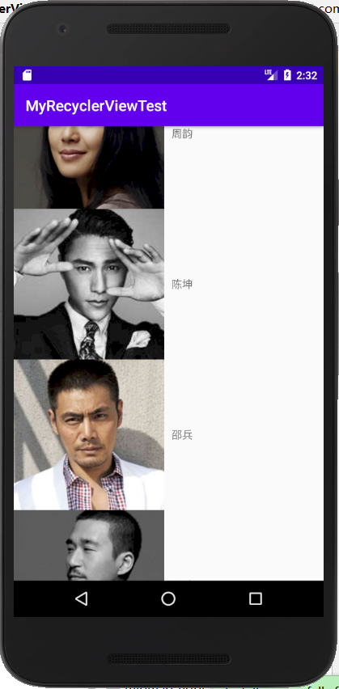

# RecyclerView

## RecyclerView的基本用法  

1. 新建MyRecyclerViewTest项目。  
2. 首先在项目的**build.gradle**中添加相应的依赖库。在**dependencies**闭包中添加如下内容：

```
 implementation 'androidx.recyclerview:recyclerview:1.0.0'
```  
添加完该行依赖后，点击右上角**Sync Now**进行同步。  

3. 修改activity_main.xml中的代码如下：  

```
<LinearLayout xmlns:android="http://schemas.android.com/apk/res/android"
    android:layout_width="match_parent"
    android:layout_height="match_parent">

    <androidx.recyclerview.widget.RecyclerView
        android:id="@+id/recycler_view"
        android:layout_width="match_parent"
        android:layout_height="match_parent" />


</LinearLayout>
```  
4.   
-  将事先准备好的图片素材复制到**MyRecyclerViewTest\app\src\main\res\drawable**路径下。
-  新建Actor类，代码如下：
```
public class Actor {
    private String name;
    private int imageId;

    public Actor(String name, int imageId) {
        this.name = name;
        this.imageId = imageId;
    }

    public String getName() {
        return name;
    }

    public int getImageId() {
        return imageId;
    }

}
``` 
- 在layout目录下新建actor_item.xml，代码如下： 

```
<?xml version="1.0" encoding="utf-8"?>
<LinearLayout xmlns:android="http://schemas.android.com/apk/res/android"
    android:layout_width="match_parent"
    android:layout_height="wrap_content">

    <ImageView
        android:id="@+id/actor_image"
        android:layout_width="wrap_content"
        android:layout_height="wrap_content" />

    <TextView
        android:id="@+id/actor_name"
        android:layout_width="wrap_content"
        android:layout_height="wrap_content"
        android:layout_gravity="center_vertical"
        android:layout_marginLeft="10dp" />


</LinearLayout>
```  

5. 接下来为RecycleView准备一个适配器，新建ActorAdapter类，代码如下：

```
public class ActorAdapter extends RecyclerView.Adapter<ActorAdapter.ViewHolder> {

    private List<Actor> mActorList;

    static class ViewHolder extends RecyclerView.ViewHolder {
        ImageView actorImage;
        TextView actorName;

        public ViewHolder(View view) {
            super(view);
            actorImage = (ImageView) view.findViewById(R.id.actor_image);
            actorName = (TextView) view.findViewById(R.id.actor_name);
        }
    }

    public ActorAdapter(List<Actor> actorList) {
        mActorList = actorList;
    }


    @Override
    public ViewHolder onCreateViewHolder(ViewGroup parent, int viewType) {
        View view = LayoutInflater.from(parent.getContext()).inflate(R.layout.actor_item, parent, false);
        ViewHolder holder = new ViewHolder(view);
        return holder;
    }

    @Override
    public void onBindViewHolder(@NonNull ViewHolder holder, int position) {
        Actor actor = mActorList.get(position);
        holder.actorImage.setImageResource(actor.getImageId());
        holder.actorName.setText(actor.getName());
    }

    @Override
    public int getItemCount() {
        return mActorList.size();
    }
}
```  

7. 最后修改MainActivity中的代码如下：  

```
public class MainActivity extends AppCompatActivity {

    private List<Actor> actorList = new ArrayList<>();

    @Override
    protected void onCreate(Bundle savedInstanceState) {
        super.onCreate(savedInstanceState);
        setContentView(R.layout.activity_main);
        initActors();
        RecyclerView recyclerView = (RecyclerView) findViewById(R.id.recycler_view);
        LinearLayoutManager layoutManager = new LinearLayoutManager(this);
        recyclerView.setLayoutManager(layoutManager);
        ActorAdapter adapter = new ActorAdapter(actorList);
        recyclerView.setAdapter(adapter);

    }

    private void initActors() {
        for (int i = 0; i < 2; i++) {
            Actor geyou = new Actor("葛优", R.drawable.geyou_pic);
            actorList.add(geyou);
            Actor jiangwen = new Actor("姜文", R.drawable.jiangwen_pic);
            actorList.add(jiangwen);
            Actor zhourunfa = new Actor("周润发", R.drawable.zhourunfa_pic);
            actorList.add(zhourunfa);
            Actor liujialing = new Actor("刘嘉玲", R.drawable.liujialing_pic);
            actorList.add(liujialing);
            Actor liaofan = new Actor("廖凡", R.drawable.liaofan_pic);
            actorList.add(liaofan);
            Actor zhouyun = new Actor("周韵", R.drawable.zhouyun_pic);
            actorList.add(zhouyun);
            Actor chenkun = new Actor("陈坤", R.drawable.chenkun_pic);
            actorList.add(chenkun);
            Actor shaobing = new Actor("邵兵", R.drawable.shaobing_pic);
            actorList.add(shaobing);
            Actor zhangmo = new Actor("张默", R.drawable.zhangmo_pic);
            actorList.add(zhangmo);
        }
    }
}
```  

运行程序，效果如下图所示：  

  

  

  


