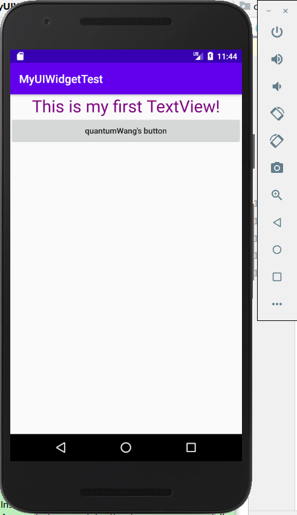
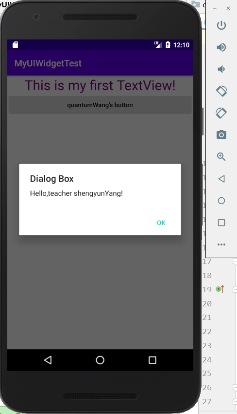
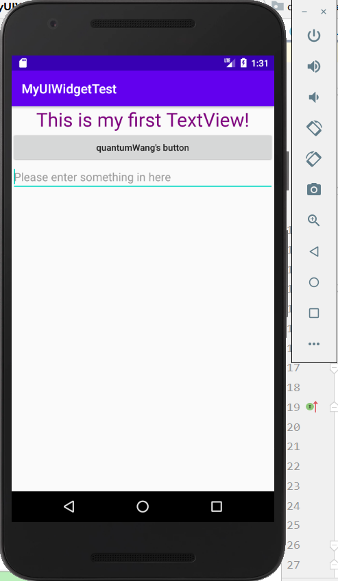
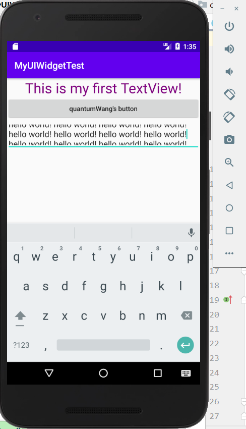
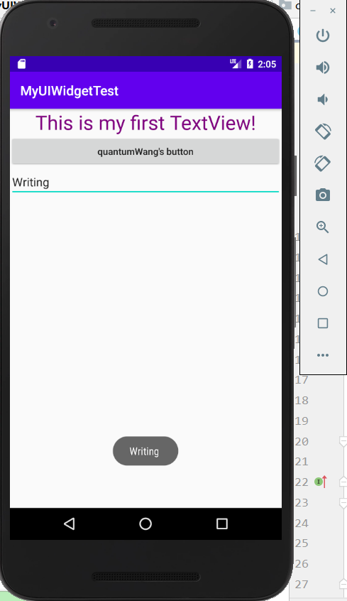
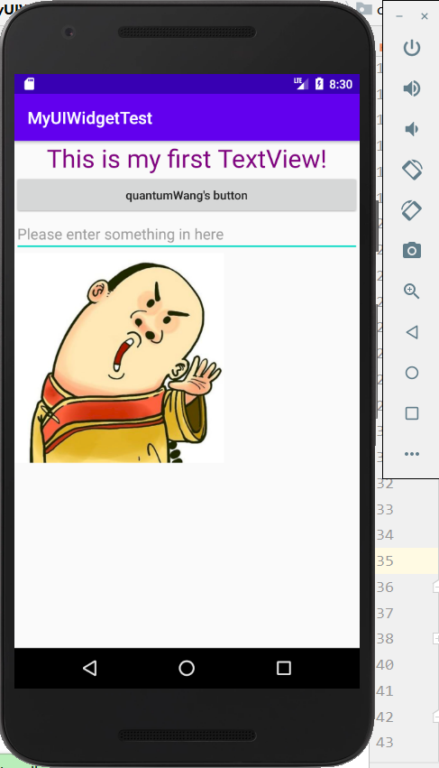
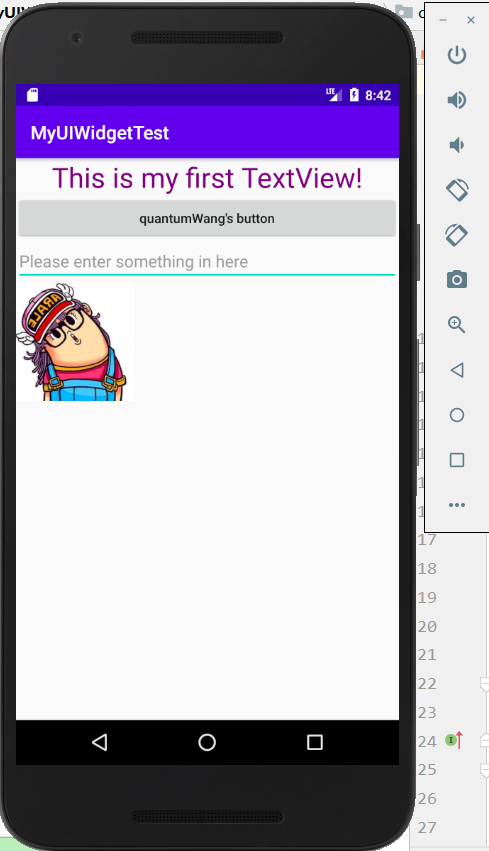

# 常用UI控件的使用及基本布局  

## TextView  
功能：主要用于在界面上显示一段文本信息  

下面通过代码测试TextView的相关用法  

修改activity_main.xml中默认生成的代码：  

```
<LinearLayout xmlns:android="http://schemas.android.com/apk/res/android"
	android:layout_width="match_parent"
	android:layout_height="match_parent"
	android:orientation="vertical">

<TextView
	android:id="@+id/text_view"
	android:layout_width="match_parent"
	android:layout_height="wrap_content"
	android:text="This is my first TextView！"></TextView>

</LinearLayout> 
```  
首先关注控件具有的一些属性，总结如下  

|  属性     |     说明 |
| :--------: | :--------:|
| android:id    |   给当前控件定义唯一标识符 |
|android:layout_width|指定控件的宽度。match_parent:当前控件的大小和父布局相同，wrap_content：让当前控件的大小能够刚好包含住里面内容|
|android:layout_height|指定控件的高度|
|android:visibility|指定控件的可见性。visible：可见；invisible：不可见，但仍然占据原来的屏幕空间；gone：不可见，但不会占据屏幕空间|  

运行程序，效果如图   

  

**注：TextView的文字默认居左上角对齐**  

修改TestView的文字对齐方式，只需设置android:gravity属性即可  

```
 android:gravity="center"
```  
重新运行程序，效果如图  

  

几个注意的点：
 + android:gravity用于指定文字的对齐方式，可选值有top、bottom、left、right、center等，可以用 | 来同时指定多个值 
 + 设置文字对齐方式的属性是 android:gravity，而不是**android:layout_gravity（坑） **

还可以对TextView中文字的大小和颜色进行修改 ，添加代码  
```
	android:textSize="30sp"
	android:textColor="#800080"
```  
重新运行程序，效果如图  


总结：  

| 属性      |     说明 |
| :--------: | :--------:|
| android:text    |   指定TextView中显示的文本内容 |
| android:gravity | 指定文字的对齐方式，可选值有 top、bottom、left、right、center 等，可以用竖线来同时指定多个值|
| android:textSize | 指定文字的大小 |
| android:textColor | 指定文字的颜色 |  

## Button  
button是安卓开发中使用频繁的一个组件，用于触发事件，与用户进行交互。  

在activity_main.xml中加入Button组件：  

```
<Button
    android:id="@+id/button"
    android:layout_width="match_parent"
    android:layout_height="wrap_content"
    android:text="quantumWang's button"
    android:textAllCaps="false" />
```  

**属性解读**  

| 属性     |     说明 | 
| :--------: | :--------:| 
|  android:layout_width |  定义按钮的宽度，match_parent:当前控件的大小和父布局相同 | 
| android:layout_height | 定义按钮的高度，wrap_content：让当前控件的大小能够刚好包含住里面内容 |
| android:text | 定义按钮显示的内容 |
| android:textAllCaps | 设置Button中字母自动进行大写转换，false表示禁止自动转换大小写 |  

运行程序，效果如下图  

  

接下来用匿名类的方式在MainActivity为Button的点击事件注册一个监听器 ，通过点击Button弹出对话框，实现对杨圣云老师问好

```
Override
protected void onCreate(Bundle savedInstanceState) {
    super.onCreate(savedInstanceState);
    setContentView(R.layout.activity_main);
    Button button = (Button) findViewById(R.id.button);//声明Button类型对象，通过finViewById方法与在xml注册的id为button的控件相关联。
    button.setOnClickListener(new View.OnClickListener() {
        @Override
        public void onClick(View view) {
            AlertDialog.Builder builder = new AlertDialog.Builder(MainActivity.this);
            builder.setTitle("Dialog Box");//设置对话框标题
            builder.setMessage("Hello,teacher shengyunYang!");//设置对话框内容
            builder.setPositiveButton("OK", null);
            builder.show();

        }
    });
}
```
运行程序，效果如图：    
  
  

## EditText  

除了Button，EditText也是程序用于和用户进行交互的另一个重要控件。它的作用是允许用户在控件里输入和编辑内容，并可以在程序中对这些内容进行处理。一些应用场景如下：  
+ 实现登陆功能，需要用户输入账号密码，获取用户输入的内容，提交给服务器进行判断   
+  发短信、发微博、聊QQ等一些需要输入文字的情景  

在界面上加入EditText示例，首先在activity_main.xml中添加如下代码：  

```
<EditText
    android:id="@+id/edit_text"
    android:layout_width="match_parent"
    android:layout_height="wrap_content"
    android:hint="Please enter something in here"
    android:maxLines="2" />
```  
经过上面几个控件的学习，我们可以总结出Android控件的的使用规律：
1. 给控件定义一个id作为唯一标识
2. 指定控件的宽度和高度
3. 适当加入一些控件的特有属性  

android:id、android:layout_width、android:layout_height我们已经很熟悉，无需多言，在这里总结下上述代码中涉及的两个EditText控件属性：

| 属性 | 说明 | 
| :--------: | :--------:|
|   android:hint  | 用于在输入框中指定一段提示性文本   |
|  android:maxLines | 用于指定ExitText的最大行数，当输入内容超过最大行数时，文本会向上滚动 |

运行程序，效果如下图  





**可以看到，未输入时EditText中显示了一段提示性文本，输入后，无论输入多少行内容，只显示最大行数的内容（此时设置为两行），相应文本向上滚动。**  

接下来通过结合使用Button和EditText实现点击按钮来获取EditText中输入的内容，修改MainActivity中的代码如下：  

```
final EditText editText = (EditText) findViewById(R.id.edit_text);
```  

重写onClick方法，如下：  

```
switch (view.getId()) {
    case R.id.button:
        String inputText = editText.getText().toString();
        Toast.makeText(MainActivity.this, inputText, Toast.LENGTH_SHORT).show();
        break;
    default:
        break;
```  

重新运行程序，在EditText中输入一段内容，然后点击按钮，效果如下图：  



## ImageView  
ImageView是用于在界面上展示图片的一个控件。接下来通过实例代码演示该控件的用法  

首先在res目录下新建一个drawable-xhdpi目录，并将事先准备好的图片放进该目录中  

接下来修改activity_main.xml中的代码如下：  

```
<ImageView
    android:id="@+id/image_view"
    android:layout_width="wrap_content"
    android:layout_height="wrap_content"
    android:src="@drawable/img_1" />
```  
**注：使用 android:src属性指定一张图片，将图片的宽度和高度都设置为wrap_content保证不管图片的尺寸多少，都能完全显示出来。**  

运行程序，效果如下图：  



通过代码动态修改ImageView中的图片，只需在MainActivity中修改如下代码：

```
final ImageView imageView = (ImageView) findViewById(R.id.image_view);  
```  

```
imageView.setImageResource(R.drawable.img_2);
```
重新运行程序，然后点击一下按钮，发现ImageView中显示图片改变了，效果如图：  



## ProgressBar  

ProgressBar用于在界面上显示一个进度条，表示程序正在加载一些数据。接下来演示点击按钮，控件的进度加上％10作为更新后的进度  

首先在activity_main.xml中添加一个进度条控件  

```
    <ProgressBar
        android:id="@+id/progress_bar"
        style="?android:attr/progressBarStyleHorizontal"
        android:layout_width="match_parent"
        android:layout_height="wrap_content"
        android:max="100" />
```  

注释：
+ style属性可以指定进度条的风格，这里设置成水平进度条  
+ android:max属性用于给进度条设置一个最大值，可在代码中动态地修改进度条的进度

设置控件的可见属性，通过android:visibility进行指定，可选值如下：
+  visible 表示控件是可见的，这个是默认值，不指定属性是仍然是可见的  
+  invisible 表示控件不可见，但仍然占据着原来的位置和大小，可以理解成透明态的控件  
+  gone 表示控件不仅不可见，而且不再占据任何屏幕空间  

修改MainActivity中的代码，如下所示：  

```
 final ProgressBar progressBar = (ProgressBar) findViewById((R.id.progress_bar));
```  

```
public void onClick(View view) {
                switch (view.getId()) {
                    case R.id.button:
                        int progress = progressBar.getProgress();
                        progress = progress + 10;
                        progressBar.setProgress(progress);
                        break;
                    default:
                        break;
                }

            }
```  

运行程序，每点击一次按钮，我们就获取进度条当前的进度，点击六次按钮后，效果如下：  


## AlertDialog  

AlertDialog用于在当前界面中弹出一个对话框，该对话框置顶于所有界面元素之上，能屏蔽掉其他控件的交互能力，一般用于提示一些重要内容或警告信息  

接下来通过代码演示AlertDialog的用法  

```
  AlertDialog.Builder dialog = new AlertDialog.Builder(MainActivity.this);//通过AlertDialog.Builder创建一个AlertDialog实例
                    dialog.setTitle("It is my Dialog");//设置对话框标题
                    dialog.setMessage("Prompt an important message.");//设置内容
                    dialog.setCancelable(false);//设置可否用Back键关闭对话框
                    dialog.setPositiveButton("OK", new DialogInterface.OnClickListener() {
                        @Override
                        public void onClick(DialogInterface dialogInterface, int i) {
                        }
                    });
                    dialog.show();//显示对话框 
```
重新运行程序，点击按钮后，效果如图：


## ProgressDialog  

ProgressDialog 和AlertDialog类似，都可以在界面上弹出一个对话框，都能屏蔽掉其他控件的交互能力。不同的是，ProgressDialog 能在对话框中显示一个进度条，一般用于提示用户等待当前比较耗时的操作。  

修改MainActivity中代码如下：  

```
ProgressDialog progressDialog = new ProgressDialog(MainActivity.this);
progressDialog.setTitle("It's progressDialog");
progressDialog.setMessage("Loading...");
progressDialog.setCancelable(true);
progressDialog.show();
```  
重新运行程序，点击按钮后效果如下：  


**注意：setCancelable()方法中传入true，表示ProgressDialog能够通过back键取消。若设置成false，则要注意在代码中做好控制，当数据加载完成时必须调用dismiss()方法关闭对话框，否则ProgressDialog将会一直存在。**  

## 四种基本布局  


  


 


